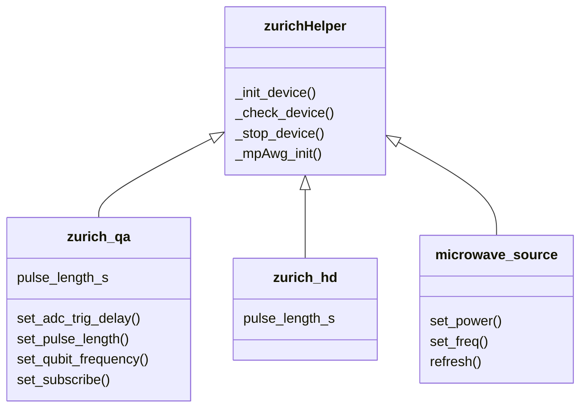

# zi_labrad

python script to control Zurich instruments by using labrad.


## Requirements

- python3, (suggested: 3.6.4)

- [scalabrad](https://github.com/ZeeUTao/scalabrad)

  Binary distribution of scalabrad are distributed via [binary](https://bintray.com/labrad/generic/scalabrad#files)

  [source code of scalabrad](https://github.com/ZeeUTao/scalabrad).

- [pylabrad](https://github.com/ZeeUTao/pylabrad-zeeu)

  ```CMD
  pip install pylabrad
  ```

  or see the forked github repository: https://github.com/ZeeUTao/pylabrad-zeeu 

- zhinst from [Zurich instrument](https://www.zhinst.com/)


## Get to start

Change the directory in `\server\xxx.ini`, see `\server\README.txt`. 

You can map a directory as M disk `M:\` for the data storage and avoid changing the directory. 

```CMD
@echo off
subst m: /d
subst m: %cd%
```


- run [scalabrad-binary](https://bintray.com/labrad/generic/scalabrad#files) via `server\open_scalabrad`: 

  ```CMD
  M:\scalabrad\bin\labrad --registry file:///M:/Registry?format=delphi
  ```

  or other ways

  

- run `LabRAD.exe`, `Registry.exe`, `Grapher.exe` in `\server\`

- run `pyle_test.py` to test. 

  you can see the live view data in `Grapher.exe` if success. 


scripts for Zurich instrument are under review

- start ipython, and run BatchRun
- run the commands in `mp.py`, for example, mp.s21_scan


## Coding style

- S.I. units are used for the number without specified units (float, int...)


## Scripts

```python
conf 
"""Script to initiate instrument, which is rarely changed and used as a single '.py' file to avoid re-initiate instrument, when we reload the other frequently changed codes, like zurichHelper.py. """

mp 
"""multiplexed codes for running experiments """

BatchRun 
"""some commands for our daily running.
We always open an 'ipython', and type 'run BatchRun' to start;
Then use 'mp.s21_scan' or others 'mp.xxx' to implement different experiments."""

zurichHelper
"""interface for instruments especially for zurich"""

waveforms
"""codes for waveforms"""

adjuster
"""interface with sliders and buttons to adjust parameters"""

pyle_test
"""tested codes"""

```


#### zurichHelper



#### mp

The script includes the functions to implement experiment like s21_scan. 

```python
@mpfunc_decorator
def s21_scan(*args)
```

The decorator `@mpfunc_decorator` do the following

- check the devices

- run the experiment
- stop the devices, and show the spent time


Although the function can be customized as you like, we recommend an example as following:

- set related parameters

  'qubits' (a list of dictionary) are used to save and pass parameters;

- prepare dataset 

  we use '.csv' to store data, and save the parameters as '.ini';

- write a function  `runSweeper` that describe your experiment

  > Note: It is better to use arguments or other ways to control your device (object), but not a global instance in the function. 

- Pass the function `runSweeper` and iterative parameters (generator) into `RunAllExperiment` to start the loop

  `RunAllExperiment` define some logic 
  
  


```python
qubits[idx]['key'] = value

dataset = sweeps.prepDataset(*args)
dataset_create(dv,dataset)

def runSweeper(devices,para_list):
    para1,para2,para3 = para_list
    
    q['experiment_length'] = start
    q['do_readout'] = True
    
    q['xy_mw_fc']
    
    q.z = [waveforms.square(amp=0)]
    q.xy = [waveforms.square(amp=0),waveforms.square(amp=0)]
    q['bias'] = bias
    
    q['experiment_length'] = start
    q['do_readout'] = True
    data = runQ([q],devices)
    
    ## analyze data and return
    for _d_ in data:
        amp = np.mean(np.abs(_d_))/q.power_r 
        phase = np.mean(np.angle(_d_))
        Iv = np.mean(np.real(_d_))
        Qv = np.mean(np.imag(_d_))
        ## multiply channel should unfold to a list for return result
        result = [amp,phase,Iv,Qv]
	return result 

axes_scans = checkAbort(gridSweep(axes), prefix=[1],func=stop_device)
RunAllExp(runSweeper,axes_scans)
```


##### multiqubits

For doing multi-qubits experiments, we can simply use the iteration in python

```python
for q in qubits:
	q['key'] = value
	## ......
data = runQ([q],devices)
```


#### waveforms 

provides several functions which define the waveforms used in experiment

```
q.xy = waveforms.square() # object
q.xy += waveforms.cosine()
q.xy += waveforms.xxxx1()
q.xy += waveforms.xxxx2()
# ...

"""

""
```

- The object is abstract, you can imagine it is a mathematical formula, and implement calculation, including added (foo1+foo2) , multiply by number (c*foo). 

  Such features are given by the Envelope (class) from pyle.envelope

  ```python
  class Envelope(object):
      """Represents a control envelope as a function of time or frequency.
      
      Envelopes can be added to each other or multiplied by constant values.
      Multiplication of two envelopes and addition of a constant value (other
      than zero) are not equivalent in time and fourier domains, so these
      operations are not supported.
      
      Envelopes keep track of their start and end time, and when added
      together the new envelope will use the earliest start and latest end,
      to cover the entire range of its constituent parts.
  ```

  

- The array (discrete sampling points on the function) is generated in the end (in `qubitServer.py`)

